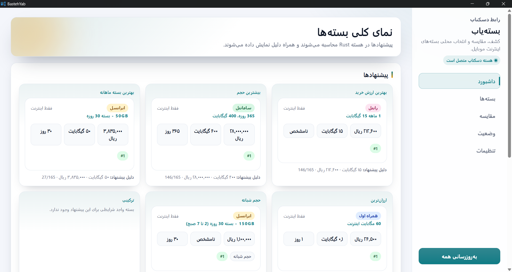
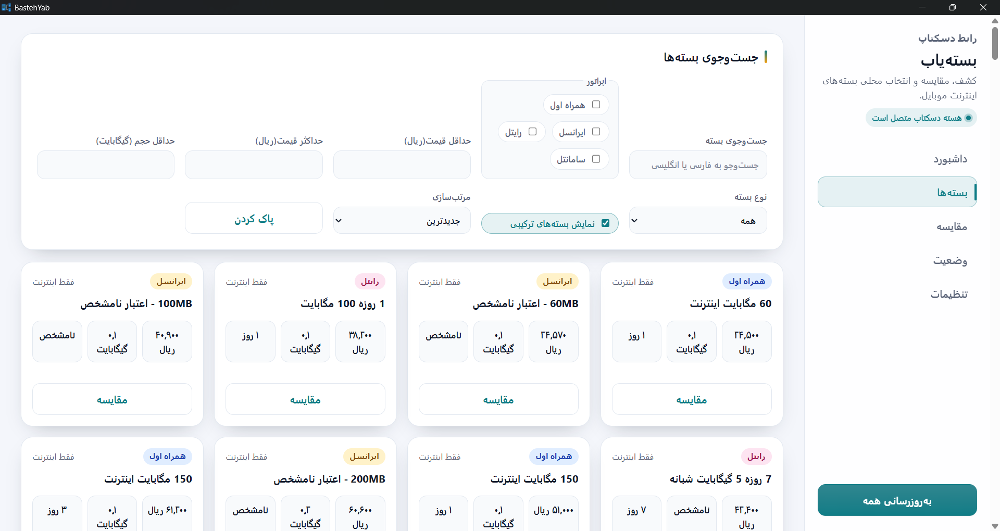
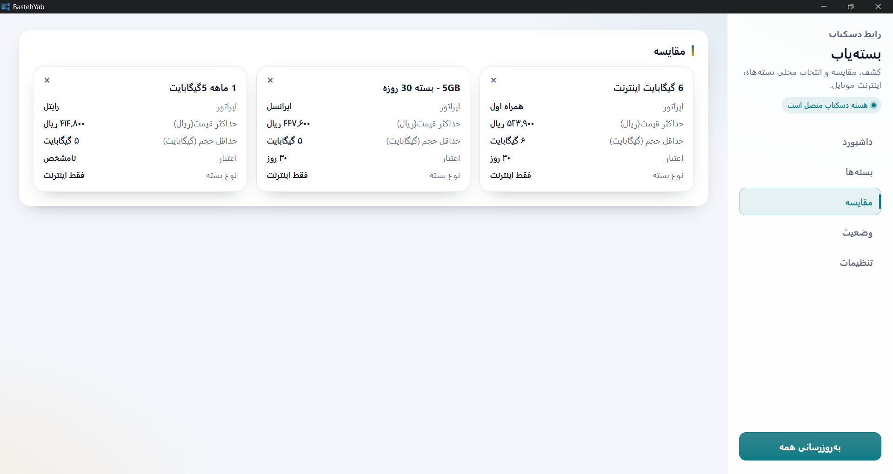
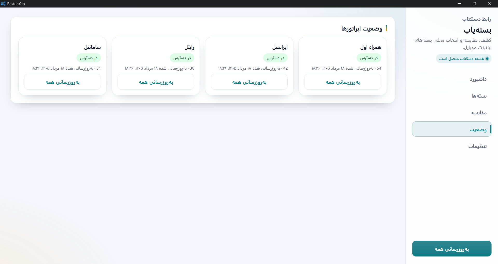
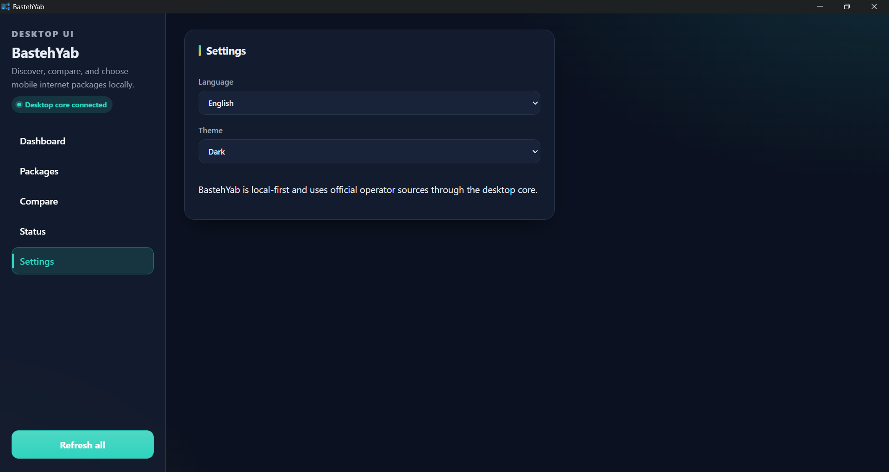

# بسته‌یاب (BastehYab)

**بسته‌یاب** یک برنامه دسکتاپ متن‌باز، Local-first و فارسی‌محور برای کشف، فیلتر، مقایسه و پیشنهاد بسته‌های اینترنت موبایل اپراتورهای ایران است.

هدف بسته‌یاب این است که کاربر بدون نیاز به حساب کاربری، سرور مرکزی یا سرویس واسطه بتواند بسته‌های اینترنت را از منابع رسمی اپراتورها دریافت کند، آن‌ها را با معیارهای قابل فهم مقایسه کند و بداند هر پیشنهاد چرا انتخاب شده است.

---

## فهرست مطالب

- [ویژگی‌ها](#ویژگیها)
- [پیش‌نمایش](#پیشنمایش)
- [اپراتورهای پشتیبانی‌شده](#اپراتورهای-پشتیبانیشده)
- [بسته‌یاب چگونه کار می‌کند؟](#بستهیاب-چگونه-کار-میکند)
- [نحوه استفاده برای کاربران عادی](#نحوه-استفاده-برای-کاربران-عادی)
- [راهنمای بخش‌های برنامه](#راهنمای-بخشهای-برنامه)
- [توسعه و اجرای پروژه از سورس](#توسعه-و-اجرای-پروژه-از-سورس)
- [دستورهای کاربردی توسعه](#دستورهای-کاربردی-توسعه)
- [معماری فنی](#معماری-فنی)
- [مدل داده و منطق پیشنهادها](#مدل-داده-و-منطق-پیشنهادها)
- [کش، تازگی داده و خطاها](#کش-تازگی-داده-و-خطاها)
- [حریم خصوصی و امنیت](#حریم-خصوصی-و-امنیت)
- [تست‌ها](#تستها)
- [مشارکت](#مشارکت)
- [مجوز](#مجوز)

---

## ویژگی‌ها

- برنامه دسکتاپ مستقل با رابط فارسی و پشتیبانی از راست‌به‌چپ.
- دریافت داده بسته‌ها از منابع رسمی اپراتورها، بدون API واسطه یا پایگاه داده ابری.
- فهرست بسته‌های اینترنتی، حتی اگر بسته شامل مکالمه، پیامک، هدیه یا مزایای دیگر هم باشد.
- فیلتر و مرتب‌سازی بسته‌ها بر اساس اپراتور، قیمت، حجم، اعتبار، نوع بسته و معیارهای دیگر.
- پیشنهادهای قابل توضیح مانند بهترین ارزش خرید، بسته ماهانه مناسب یا بیشترین حجم.
- محاسبه منطق فیلتر و پیشنهاد در هسته Rust، نه در رابط کاربری.
- ذخیره‌سازی محلی داده‌های معتبر برای استفاده هنگام اختلال یا نبود دسترسی به اپراتورها.
- پشتیبانی از موفقیت جزئی؛ خرابی یک اپراتور نباید داده اپراتورهای دیگر را از کار بیندازد.
- بدون حساب کاربری، تله‌متری، تبلیغات، ردیابی یا سرویس ابری اجباری.

---

## پیش‌نمایش
|             داشبورد              |            بسته‌ها             |
|:--------------------------------:|:------------------------------:|
|  |  |
|              مقایسه              |             وضعیت              |
|      |      |
|             تنظیمات              |                                |
|    |                                |


---
## اپراتورهای پشتیبانی‌شده

نسخه اولیه پروژه برای جمع‌آوری و نمایش بسته‌های اینترنت این اپراتورها طراحی شده است:

| اپراتور | نام فارسی | شناسه داخلی |
| --- | --- | --- |
| MCI | همراه اول | `mci` |
| Irancell | ایرانسل | `irancell` |
| Rightel | رایتل | `rightel` |
| Samantel | سامانتل | `samantel` |

> نکته: بسته‌یاب فقط بسته‌هایی را وارد مجموعه اصلی می‌کند که شامل اینترنت/دیتا باشند. بسته‌های ترکیبی اینترنت + مکالمه یا اینترنت + پیامک همچنان بسته اینترنتی معتبر محسوب می‌شوند.

---

## بسته‌یاب چگونه کار می‌کند؟

جریان اصلی داده در بسته‌یاب به شکل زیر است:

```text
منبع رسمی اپراتور
      ↓
Collector مستقل هر اپراتور
      ↓
مدل خام مخصوص همان اپراتور
      ↓
Normalizer
      ↓
اعتبارسنجی
      ↓
مدل مشترک InternetPackage
      ↓
کش محلی
      ↓
فیلتر / پیشنهاد / مقایسه
      ↓
Tauri IPC
      ↓
رابط React/TypeScript
```

رابط کاربری مستقیماً وب‌سایت اپراتورها را اسکرپ نمی‌کند. ارتباط با اپراتورها، عادی‌سازی داده‌ها، فیلترها و پیشنهادها در هسته Rust انجام می‌شوند و فقط خروجی امن و تایپ‌شده از طریق فرمان‌های Tauri به UI می‌رسد.

---

## نحوه استفاده برای کاربران عادی

پس از انتشار نسخه آماده نصب:

1. فایل نصب یا نسخه قابل حمل بسته‌یاب را از صفحه انتشارهای پروژه دریافت کنید.
2. برنامه را نصب یا اجرا کنید.
3. بسته‌یاب هنگام اجرا داده‌های ذخیره‌شده قبلی را نمایش می‌دهد و در صورت نیاز به‌روزرسانی را آغاز می‌کند.
4. از دکمه **به‌روزرسانی همه** برای دریافت تازه‌ترین داده‌های اپراتورها استفاده کنید.
5. در صفحه **بسته‌ها**، بسته‌ها را جست‌وجو، فیلتر و مرتب کنید.
6. برای مقایسه، روی دکمه **مقایسه** در کارت بسته‌ها کلیک کنید. حداکثر سه بسته هم‌زمان قابل مقایسه‌اند.
7. در صفحه **داشبورد** پیشنهادها و دلیل هر پیشنهاد را ببینید.
8. در صفحه **وضعیت**، تازگی یا قدیمی بودن داده هر اپراتور و خطاهای احتمالی را بررسی کنید.

کاربر نهایی برای استفاده از نسخه منتشرشده نباید Node.js، npm، Rust، Cargo، Python یا Docker نصب کند.

---

## راهنمای بخش‌های برنامه

### داشبورد

نمای کلی برنامه است. پیشنهادهای محاسبه‌شده توسط هسته Rust و وضعیت کلی اپراتورها در این صفحه دیده می‌شود.

### بسته‌ها

محل اصلی مرور بسته‌ها است. در این صفحه می‌توانید:

- نام بسته را جست‌وجو کنید؛
- اپراتور را محدود کنید؛
- حداقل و حداکثر قیمت را تعیین کنید؛
- حداقل حجم عمومی را مشخص کنید؛
- اعتبار روزانه، هفتگی، ماهانه یا بلندمدت را انتخاب کنید؛
- بسته‌های اینترنتی یا ترکیبی را جدا کنید؛
- بسته‌ها را بر اساس جدیدترین، بهترین ارزش خرید، ارزان‌ترین یا بیشترین حجم مرتب کنید.

### مقایسه

در این بخش بسته‌های انتخاب‌شده کنار هم نمایش داده می‌شوند تا تفاوت قیمت، حجم، اعتبار، اپراتور، نوع سیم‌کارت و مزایا بهتر دیده شود.

### وضعیت

برای هر اپراتور نشان می‌دهد داده در دسترس است یا خیر، آیا از کش قدیمی استفاده می‌شود، آخرین به‌روزرسانی موفق چه زمانی بوده و آیا خطایی رخ داده است.

### تنظیمات

امکان تغییر زبان رابط و پوسته روشن/تیره را فراهم می‌کند.

---

## توسعه و اجرای پروژه از سورس

این بخش مخصوص توسعه‌دهندگان است. برای اجرای پروژه از سورس به ابزارهای توسعه نیاز دارید؛ این نیاز فقط برای توسعه است و شامل کاربران نسخه نهایی نمی‌شود.

### پیش‌نیازها

- Node.js و npm
- Rust و Cargo
- پیش‌نیازهای Tauri 2 برای سیستم‌عامل شما
- روی ویندوز: ابزارهای ساخت موردنیاز Tauri/WebView2 طبق مستندات رسمی Tauri

### نصب وابستگی‌ها

```bash
npm install
```

### اجرای رابط وب در حالت توسعه

```bash
npm run dev
```

این دستور فقط سرور توسعه Vite را اجرا می‌کند. در این حالت برخی قابلیت‌های وابسته به Tauri IPC ممکن است در مرورگر در دسترس نباشند.

### اجرای برنامه دسکتاپ در حالت توسعه

```bash
npm run tauri dev
```

این دستور برنامه Tauri را اجرا می‌کند، هسته Rust را بالا می‌آورد و رابط React را در پنجره دسکتاپ نمایش می‌دهد.

---

## دستورهای کاربردی توسعه

| دستور                                                       | کاربرد                                      |
|-------------------------------------------------------------|---------------------------------------------|
| `npm install`                                               | نصب وابستگی‌های فرانت‌اند و ابزار Tauri CLI |
| `npm run dev`                                               | اجرای Vite برای توسعه رابط کاربری           |
| `npm run build`                                             | بررسی TypeScript و ساخت خروجی فرانت‌اند     |
| `npm run typecheck`                                         | بررسی تایپ‌های TypeScript بدون ساخت خروجی   |
| `npm run lint`                                              | در وضعیت فعلی معادل بررسی TypeScript است    |
| `npm run tauri dev`                                         | اجرای برنامه دسکتاپ در حالت توسعه           |
| `npm run tauri build`                                       | ساخت بسته دسکتاپ با Tauri                   |
| `cargo test --manifest-path src-tauri/Cargo.toml`           | اجرای تست‌های Rust                          |
| `cargo fmt --manifest-path src-tauri/Cargo.toml -- --check` | بررسی قالب‌بندی Rust                        |

---

## معماری فنی

فناوری‌های اصلی پروژه:

- **Tauri 2** برای پوسته دسکتاپ؛
- **Rust** برای هسته برنامه، ارتباط با اپراتورها، عادی‌سازی، کش، فیلتر و پیشنهادها؛
- **React + TypeScript** برای رابط کاربری؛
- **Vite** برای توسعه و ساخت فرانت‌اند؛
- **JSON-based local cache** برای کش اولیه داده‌ها.

مرزهای معماری:

- هسته Rust مسئول منطق حساس و دامنه‌ای است.
- UI فقط داده را نمایش می‌دهد و فرمان‌های تایپ‌شده Tauri را فراخوانی می‌کند.
- الگوریتم پیشنهاد یا عادی‌سازی نباید در React دوباره پیاده‌سازی شود.
- هر اپراتور collector مستقل خود را دارد تا خرابی یک اپراتور کل برنامه را خراب نکند.

---

## مدل داده و منطق پیشنهادها

بسته‌ها قبل از نمایش به مدل مشترک `InternetPackage` تبدیل می‌شوند. این مدل شامل اطلاعاتی مانند موارد زیر است:

- شناسه بسته؛
- اپراتور؛
- نام بسته؛
- قیمت با واحد داخلی ریال؛
- مدت اعتبار؛
- سهمیه‌های دیتا با نوع و محدودیت مشخص؛
- نوع سیم‌کارت؛
- مکالمه و پیامک در صورت وجود؛
- اطلاعات خرید و موجود بودن؛
- فراداده و وضعیت تازگی.

پیشنهادها باید معیار شفاف داشته باشند. برای نمونه:

- **بهترین ارزش خرید:** بر اساس قیمت هر گیگابایت حجم عمومی، با رعایت محدودیت‌ها.
- **ارزان‌ترین بسته:** بر اساس کمترین قیمت معتبر.
- **بیشترین حجم عمومی:** فقط حجم عمومی قابل استفاده را در نظر می‌گیرد.
- **بسته ماهانه مناسب:** فقط بسته‌هایی را بررسی می‌کند که اعتبار واقعاً ۳۰روزه دارند.

در صورت مساوی بودن بسته‌ها، tie-break باید قطعی باشد تا خروجی هر بار تغییر تصادفی نکند.

---

## کش، تازگی داده و خطاها

بسته‌یاب برای مفید ماندن در زمان اختلال اپراتورها از کش محلی استفاده می‌کند:

- داده معتبر قبلی می‌تواند بلافاصله نمایش داده شود.
- به‌روزرسانی تازه در پس‌زمینه یا با درخواست کاربر انجام می‌شود.
- نتیجه خراب، خالی، نامعتبر یا مشکوک نباید کش معتبر قبلی را حذف کند.
- تازگی داده برای هر اپراتور جداگانه نگهداری می‌شود.
- UI باید تفاوت داده تازه و داده ذخیره‌شده/قدیمی را نشان دهد.

خطاهای مورد انتظار مانند timeout، خطای شبکه، JSON نامعتبر، تغییر HTML یا نبودن فیلدها باید مدیریت شوند و باعث کرش برنامه نشوند.

---

## حریم خصوصی و امنیت

بسته‌یاب با رویکرد حداقل‌گرایانه طراحی شده است:

- حساب کاربری ندارد.
- تله‌متری، analytics، تبلیغات یا ردیابی رفتاری ندارد.
- داده‌ها و تنظیمات کاربر محلی باقی می‌مانند.
- کوکی شخصی، توکن موقت، bearer token یا اطلاعات ورود نباید در مخزن ذخیره شود.
- جاوااسکریپت دریافت‌شده از وب‌سایت اپراتورها نباید اجرا شود.
- رشته‌های خارجی باید نامطمئن فرض شوند و با احتیاط در UI نمایش داده شوند.

---

## تست‌ها

تست‌های عادی پروژه نباید به زنده بودن وب‌سایت اپراتورها وابسته باشند. منطق‌های مهم باید با داده‌های ساختگی یا fixtureهای پاک‌سازی‌شده تست شوند.

اجرای بررسی‌های رایج:

```bash
npm run typecheck
```

```bash
npm run build
```

```bash
cargo test --manifest-path src-tauri/Cargo.toml
```

```bash
cargo fmt --manifest-path src-tauri/Cargo.toml -- --check
```

حوزه‌هایی که باید پوشش تست داشته باشند شامل عادی‌سازی، تبدیل واحد، تبدیل قیمت، فیلتر، رتبه‌بندی پیشنهادها، tie-break، حجم محدود، بسته‌های ترکیبی، داده خراب upstream و اعتبارسنجی کش است.

---

## مشارکت

برای مشارکت در پروژه:

1. مسئله یا تغییر موردنظر را کوچک و مشخص نگه دارید.
2. قبل از تغییرات معماری یا دامنه‌ای، `AGENTS.md` و `DESIGN.md` را بخوانید.
3. مسئولیت‌های Rust و React را جابه‌جا نکنید.
4. وابستگی جدید فقط وقتی اضافه شود که واقعاً لازم باشد.
5. قالب‌بندی، typecheck و تست‌های مرتبط را اجرا کنید.
6. هیچ راز، کوکی، توکن، session id یا داده شخصی را commit نکنید.

---

## مجوز

این پروژه تحت مجوز **MIT** منتشر شده است. متن کامل مجوز در فایل [`LICENSE`](LICENSE) قرار دارد.
